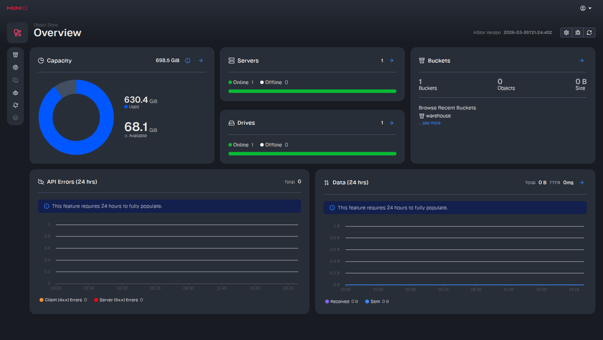
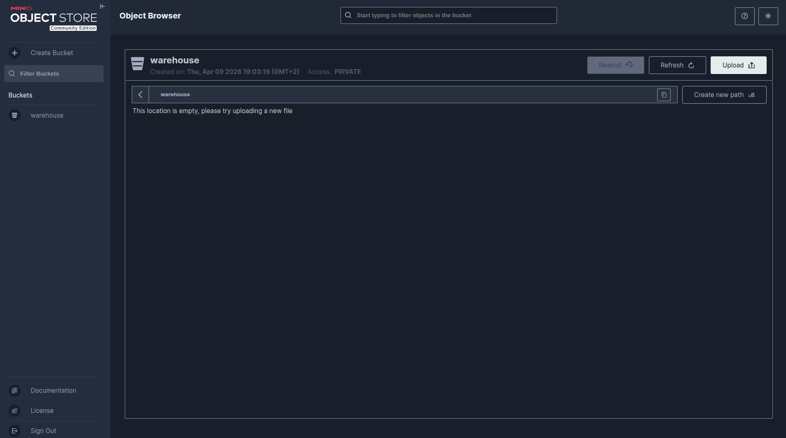

# Description
Documentation about Minio Docker Deployment.

## Deployment
To start minio as docker container depends ig you use Ubuntu 20.04 LTS or Ubuntu 24.04 LTS, also depends if you want to use the comertial version Minio AIStore using a free licence or the OpenSoure version:

- In Ubuntu 20.04:

    Using the Minio AIStore commercial version you must requets a free license from [minio web portal](https://www.min.io/download) click in Request License Key, and select the free one. **This version maintains the visual notification events menu options and bind this ones at bucket level**

    ```shell
    $ docker run -d  \
    --name "aistor-server" \
    -p 9000:9000 -p 9001:9001 \
    -v minio_data:/mnt/data \
    -v $HOME/temp/minio/minio.license:/minio.license \
    quay.io/minio/aistor/minio:latest minio server /mnt/data \
    --address "0.0.0.0:9000" \
    --console-address "0.0.0.0:9001" \
    --license /minio.license
    ```

    

    Using the Minio Opensource version. **The last Open Source versions don't have visual events configurations nor binding of this ones at bucket., only from minio CLI (mc)**

    ```shell
    $ docker run -d \
    --name "minio-open" \
    -p 9000:9000 -p 9001:9001 \
    -v minio_data:/data \
    quay.io/minio/minio:latest server /data \
    --address "0.0.0.0:9000" \
    --console-address "0.0.0.0:9001"
    ```

    

- In Ubuntu 24.04:

    Usin the Minio AIStore commercial version you must requets a free license from [minio web portal](https://www.min.io/download) click in Request License Key, and select the free one.

    ```shell
    $ docker run -d  \
    --name "aistor-server" \
    -p 9000:9000 -p 9001:9001 \
    -v minio_data:/mnt/data \
    -v $HOME/temp/minio/minio.license:/minio.license \
    quay.io/minio/aistor/minio:latest minio server /mnt/data \
    --license /minio.license
    ```

    Using the Minio Opensource version:

    ```shell
    $ docker run -d \
    --name "minio-open" \
    -p 9000:9000 -p 9001:9001 \
    -v minio_data:/data \
    quay.io/minio/minio:latest server /data
    ```